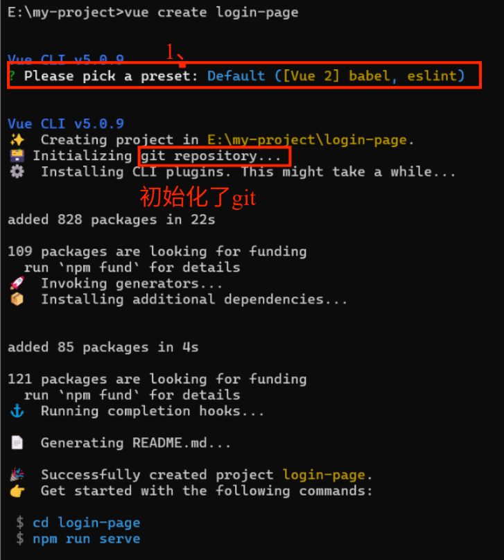
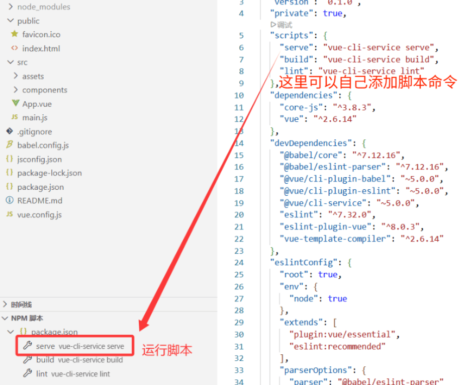
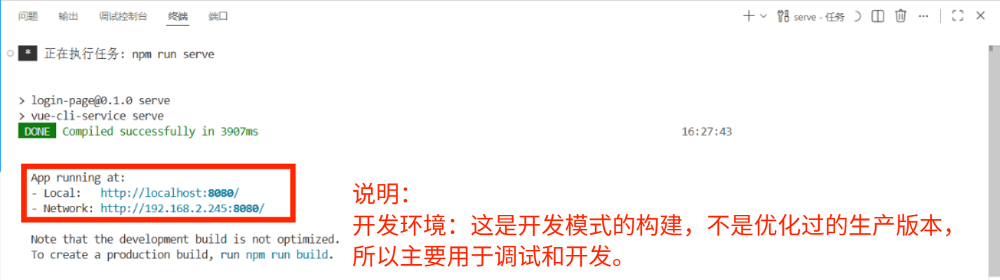
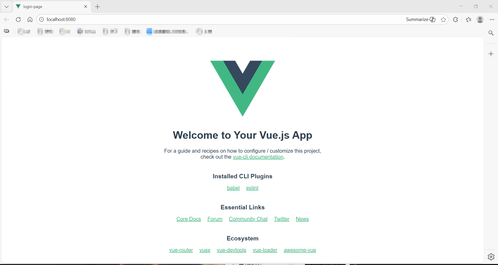
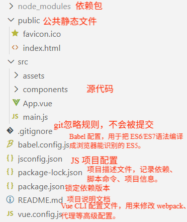

# login-page

## Project setup
```
npm install
```

### Compiles and hot-reloads for development
```
npm run serve
```

### Compiles and minifies for production
```
npm run build
```

### Lints and fixes files
```
npm run lint
```

### Customize configuration
See [Configuration Reference](https://cli.vuejs.org/config/).

#### 创建一个vue2项目
##### 一、准备环境
确认你本地有 **Node.js**：
node -v

npm -v

如果没有，先去装 Node.js，[Node.js — 在任何地方运行 JavaScript](https://nodejs.org/zh-cn)


这里如果版本不对应会有警告（如果继续用现在的 npm 可能会遇到奇怪问题（安装依赖报错、CLI 异常等））：

需要升级npm或者调整Node.js版本。
#### 二、安装 Vue CLI
npm install -g @vue/cli


**Vue CLI 安装成功**，这里可以正常使用 `vue` 命令。
输入vue --version


关于**Vue CLI ：Vue CLI（Command Line Interface）** 是官方提供的 **Vue.js 项目脚手架工具**，用于快速创建和管理 Vue 项目。Vue 官方文档明确指出：

> ⚠️ **Vue CLI 现已处于维护模式！**

- 对于 **旧项目或 Vue 2**，CLI 仍然是最稳定、最成熟的工具。
    
- Vite 原生主要面向 **Vue 3**
#### 三、创建 Vue 2 项目
vue create 项目名称
然后会进入**交互式选择**：

1、选择了预设：
    
    - **Vue 2**：选择 Vue 2 版本。
        
    - **Babel**：用于把新版本 JavaScript 转换成浏览器能理解的语法。
        
    - **ESLint**：代码风格检查工具，帮助保持代码规范。
#### 四、在VSCode启动项目
##### 1、运行

运行成功：


##### 2、项目结构

###### **src 目录（核心开发目录）**
assets/   
components/  
App.vue  
main.js`

**解释：**

- **assets/**  
    存放静态资源（图片、字体、样式等），会被 webpack 打包。
    
- **components/**  
    存放 Vue 组件，通常是可复用的小组件。
    
- **App.vue**  
    根组件，整个项目的入口组件，里面通常包含 `<router-view>` 或 `<slot>`。
    
- **main.js**  
    项目入口文件，用来初始化 Vue 实例、引入全局组件、插件和路由。